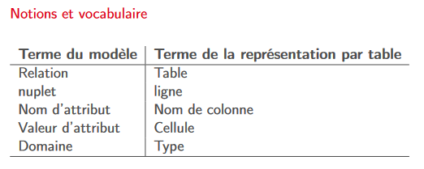

# Document NFP107

## I - Le modèle relationnel

Deux problématiques :

- La structuration des données avec la normalisation pour obtenir un schéma correct
- Les langages d’interrogation, le SQL

### Relations et nuplets

Notion mathématique : Étant donné un ensemble d’objets O, une relation (binaire) sur O est un sous-ensemble du produit
cartésien O × O.

##### relation

`Une relation de degré n sur les domaines A1, A2, · · · , An est
un sous-ensemble fini du produit cartésien A1 × A2 × · · · × An`
Dans la représentation par table, une relation est une table

##### Nuplet

`Un élément d’une relation de dimension n est un nuplet (a1, a2, · · · , an).`
Dans la représentation par table, un nuplet est une ligne.

##### Schéma de relations

`C’est le schéma de la relation, de la forme R(A1 : D1, A2 : D2, · · · , An : Dn`

##### 1NF

`Une relation est en première forme normale si toutes les valeurs d’attribut sont connues et atomiques et si elle ne contient aucun doublon.`



### Qualité d'un schéma relationnel

Les notions sont :

- Les anomalies et incohérences dues à un schéma défectueux
- Les dépendances fonctionnelles
- Les clés primaires et étrangères
- La normalisation

###### Dépendance fonctionnelle

`Il y a dépendance fonctionnelle A → B entre deux attributs A et B d’une relation R quand la connaissance de la valeur de A implique la connaissance de la valeur de B.`

On se restreint pour l’étude de la normalisation aux DF minimales et directes.

##### Minimale

`A → X minimal s'il n'existe pas de sous ensemble S de A telle que S -> X`
`Une DF A → X est directe si elle n'est pas obtenue par transitivé`

##### Clé

`Une clé d’une relation R est un sous-ensemble minimal C des attributs tels que tout attribut de R dépend fonctionnellement de C.`

##### 3NF

`Un schéma de relation R est normalisé quand, dans toute dépendance fonctionnelle S → A sur les attributs de R, S est une clé.`

##### Contrainte d'unicité

`Une valeur de clé ne peut apparaître qu’une fois dans une relation.`

##### Contrainte d'intégrité référentielle

`La valeur d’une clé étrangère doit toujours être également une des valeurs de la clé
référencée.`

## II - SQL, langage déclaratif

### Logique

##### Les équivalences

- ¬(¬F) est équivalente à F
- F ∨ (F1 ∧ F2) est équivalente à (F ∨ F1) ∧ (F ∨ F2) (distribution)
- F ∧ (F1 ∨ F2) est équivalente à (F ∧ F1) ∨ (F ∧ F2) (distribution)
- ¬(F1 ∧ F2) est équivalente à (¬F1) ∨ (¬F2) (loi DeMorgan)
- ¬(F1 ∨ F2) est équivalente à (¬F1) ∧ (¬F2) (loi DeMorgan)
  Donc p ∨ ¬(p ∧ ¬q) est une tautologie.

##### Les prédicats

Extension puissante des propositions : construire des énoncés sur des “objets”.
Le prédicat Compose(X, Y) permet de construire des énoncés de la forme : `Compose(’Mozart’, ’Don Giovanni’)`
Ce sont les nuplets.

##### Nuplets ouverts et fermés

Un nuplet énoncé avec des constantes est un nuplet fermé. `Compose(’Mozart’, ’Don Giovanni’)`\
Un nuplet énoncé avec au moins une variable est un nuplet ouvert. `Compose(X, ’Don Giovanni’)`

Requête SQL = une formule avec des variables libres.
Résultat d’une requête = les valeurs des variables libres qui satisfont la formule.

### SQL Conjonctif

Quelle que soit sa complexité, l’interprétation d’une requête SQL peut toujours se faire
de la manière suivante.

- Chaque variable du from peut être affectée à tous les nuplets de sa portée.
- Le where définit une condition sur ces variables : seules les affectations satisfaisant
  cette condition sont conservées
- Le nuplet résultat est construit à partir de ces affectations

### Quantificateur et négation

##### exists

Requête “les logements où l’on peut faire du ski”.

```SQL
select distinct l.nom
from Logement as l,
     Activité as a
where l.code = a.codeLogement
  and a.codeActivité = 'Ski'
```

“a“ n’intervient pas dans le nuplet-résultat. On peut la remplacer par une variable liée.

```SQL
select distinct l.nom
from Logement as l
where exists (select 1
              from Activité as a
              where l.code = a.codeLogement
                and a.codeActivité = 'Ski')
```

Légère reformulation : maintenant, on cherche les logements tels qu’il existe une activité “Ski”.

##### Quantificateur et négation

Les logements qui ne proposent pas de Ski.

```SQL
select distinct l.nom
from Logement as l
where not exists (select ’’
                  from Activité as a
                  where l.code = a.codeLogement
                    and a.codeActivité = 'Ski')
```

Correspond à la formulation : “Les logements tels qu’il n’existe
pas d’activité Ski”.

##### Quantificateur universel

Les voyageurs qui sont allés dans tous les logements

```SQL 
select distinct v.prénom, v.nom
from Voyageur as v
where not exists (select ’’
                  from Logement as l
                  where not exists (select ’’
                                    from Séjour as s
                                    where l.code = s.codeLogement
                                      and v.idVoyageur = s.idVoyageur))
```

Reformulation avec double négation : on cherche les voyageurs tels qu’il n’existe pas de logement où ils ne sont pas
allés.

## III - SQL Algébrique

SQL propose un autre type d’interrogation, fonctionnelle, basée sur l’algèbre
relationnelle.\
L’algèbre est un ensemble de 6 opérateurs, qui présentent deux propriétés essentielles

- Clôture : un opérateur s’applique à des relations et produit une relation
- Composition : un opérateur peut prendre en entrée le résultat d’un autre pour définir des requêtes algébriques
  complexes

6 opérateurs : projection, sélection, produit cartésien, renommage, union, différence

##### Projection, π

C'est le select en SQL, sans doublon

##### Sélection, σ

La sélection σF (R) s’applique à une relation, R, et en extrait les nuplets qui satisfont F
σlieu=′Corse′ (Logement)\
En SQL : `select * from Logement where lieu = 'Corse'`.
Les comparaisons s’écrivent AΘB, où Θ appartient à {=, <, >, ≤, ≥}.

##### Produit cartésien, ×

R × S produit une relation où chaque nuplet de R est associé à chaque nuplet de S.\
En SQL, c'est la clause `cross join`.

##### Renommage, ρ

L’expression ρA→C, B→D (T) renomme A en C et B en D dans la relation T.\
La requête `select Voyageur.idVoyageur, Séjour.idVoyageur from Voyageur cross join Séjour`
engendre une erreur **duplicate field name**\
Bonne version `select Voyageur.idVoyageur as idV1, Séjour.idVoyageur as idV2
from Voyageur cross join Séjour`

Le _as_ permet aussi de renommer des relations.

##### L'union, ∪

R ∪ S produit une relation contenant l’union de R S (qui doivent avoir le même schéma).\
En SQL, rarement utilisée, mais indispensable (pas d’autre expression
possible) en cas de besoin :

```SQL 
select lieu
from Logement
union
select région as lieu
from Voyageur
```

##### La différence, −

RS produit une relation contenant les nuplets de R qui ne sont pas dans S (elles doivent avoir le même schéma).
n SQL

```SQL
select lieu
from Logement
except
select région as lieu
from Voyageur
```

Très peu pratique à cause de la contrainte sur les schémas. La version déclarative, not exists, est bien plus facile.

### La jointure

C'est une sélection appliquée à un produit cartésien.\
La jointure algébrique s’effectue en SQL dans la clause from.\
`select * from Logement join Activité on (code=codeLogement)`
On peut avoir le même résultat en déclaratif.

##### Résolution des ambigüités

La requête suivante renvoie une erreur à cause de l’ambiguité sur idVoyageur.
`select * from Voyageur join Séjour on (idVoyageur=idVoyageur)`

Première solution : on énumère les attributs en effectuant des renommages.

```SQL
select V.idVoyageur as idV1, V.nom, S.idVoyageur as idV2, début, fin
from Voyageur as V
         join Séjour as S
              on (V.idVoyageur = S.idVoyageur)
```

Seconde solution : le renommage a lieu avant la jointure.
Expression algébrique :
`ρidVoyageur →idV 1(πidVoyageur ,nomVoyageur) [JOINTURE ON]idV 1=idV 2 ρidVoyageur →idV 2(πidVoyageur ,d ´ebut,finSéjour)`\
Requête SQL :

```SQL
select *
from (select idVoyageur as idV1, nom from Voyageur) as V
         join
         (select idVoyageur as idV2, début, fin from Séjour) as S
         on (V.idV1 = S.idV2)
```

On met l’expression algébrique dans le from : elle définit la relation interrogée.

##### Composition des jointures

On peut placer des expressions algébriques quelconques dans le from. Ici, deux jointures.
Lisibilité aléatoire... À comparer avec la version déclarative.

```SQL
select nomVoyageur, nomLogement
from ((select idVoyageur as idV, nom as nomVoyageur from Voyageur) as V
    join
    Séjour as S on idV = idVoyageur)
         join
         (select code, nom as nomLogement from Logement) as L
         on codeLogement = code
```