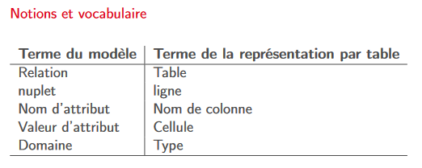
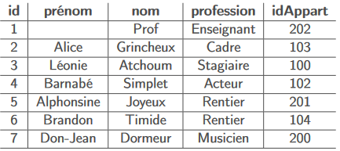
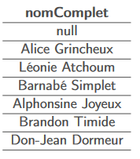
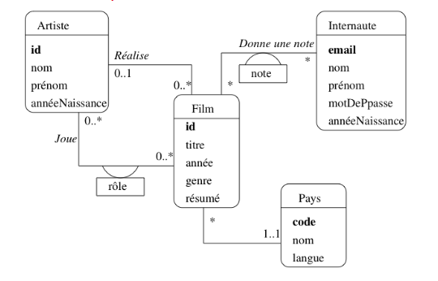
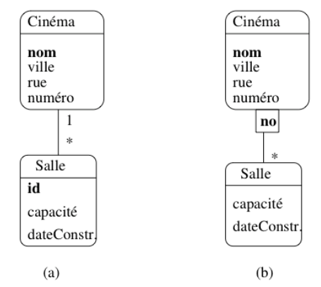

# Document NFP107

## I - Le modèle relationnel

Deux problématiques :

- La structuration des données avec la normalisation pour obtenir un schéma correct
- Les langages d’interrogation, le SQL

### Relations et nuplets

Notion mathématique : Étant donné un ensemble d’objets O, une relation (binaire) sur O est un sous-ensemble du produit
cartésien O × O.

##### relation

`Une relation de degré n sur les domaines A1, A2, · · · , An est
un sous-ensemble fini du produit cartésien A1 × A2 × · · · × An`
Dans la représentation par table, une relation est une table

##### Nuplet

`Un élément d’une relation de dimension n est un nuplet (a1, a2, · · · , an).`
Dans la représentation par table, un nuplet est une ligne.

##### Schéma de relations

`C’est le schéma de la relation, de la forme R(A1 : D1, A2 : D2, · · · , An : Dn`

##### 1NF

`Une relation est en première forme normale si toutes les valeurs d’attribut sont connues et atomiques et si elle ne contient aucun doublon.`



### Qualité d'un schéma relationnel

Les notions sont :

- Les anomalies et incohérences dues à un schéma défectueux
- Les dépendances fonctionnelles
- Les clés primaires et étrangères
- La normalisation

###### Dépendance fonctionnelle

`Il y a dépendance fonctionnelle A → B entre deux attributs A et B d’une relation R quand la connaissance de la valeur de A implique la connaissance de la valeur de B.`

On se restreint pour l’étude de la normalisation aux DF minimales et directes.

##### Minimale

`A → X minimal s'il n'existe pas de sous ensemble S de A telle que S -> X`
`Une DF A → X est directe si elle n'est pas obtenue par transitivé`

##### Clé

`Une clé d’une relation R est un sous-ensemble minimal C des attributs tels que tout attribut de R dépend fonctionnellement de C.`

##### 3NF

`Un schéma de relation R est normalisé quand, dans toute dépendance fonctionnelle S → A sur les attributs de R, S est une clé.`

##### Contrainte d'unicité

`Une valeur de clé ne peut apparaître qu’une fois dans une relation.`

##### Contrainte d'intégrité référentielle

`La valeur d’une clé étrangère doit toujours être également une des valeurs de la clé
référencée.`

## II - SQL, langage déclaratif

### Logique

##### Les équivalences

- ¬(¬F) est équivalente à F
- F ∨ (F1 ∧ F2) est équivalente à (F ∨ F1) ∧ (F ∨ F2) (distribution)
- F ∧ (F1 ∨ F2) est équivalente à (F ∧ F1) ∨ (F ∧ F2) (distribution)
- ¬(F1 ∧ F2) est équivalente à (¬F1) ∨ (¬F2) (loi DeMorgan)
- ¬(F1 ∨ F2) est équivalente à (¬F1) ∧ (¬F2) (loi DeMorgan)
  Donc p ∨ ¬(p ∧ ¬q) est une tautologie.

##### Les prédicats

Extension puissante des propositions : construire des énoncés sur des “objets”.
Le prédicat Compose(X, Y) permet de construire des énoncés de la forme : `Compose(’Mozart’, ’Don Giovanni’)`
Ce sont les nuplets.

##### Nuplets ouverts et fermés

Un nuplet énoncé avec des constantes est un nuplet fermé. `Compose(’Mozart’, ’Don Giovanni’)`\
Un nuplet énoncé avec au moins une variable est un nuplet ouvert. `Compose(X, ’Don Giovanni’)`

Requête SQL = une formule avec des variables libres.
Résultat d’une requête = les valeurs des variables libres qui satisfont la formule.

### SQL Conjonctif

Quelle que soit sa complexité, l’interprétation d’une requête SQL peut toujours se faire
de la manière suivante.

- Chaque variable du from peut être affectée à tous les nuplets de sa portée.
- Le where définit une condition sur ces variables : seules les affectations satisfaisant
  cette condition sont conservées
- Le nuplet résultat est construit à partir de ces affectations

### Quantificateur et négation

##### exists

Requête “les logements où l’on peut faire du ski”.

```SQL
select distinct l.nom
from Logement as l,
     Activité as a
where l.code = a.codeLogement
  and a.codeActivité = 'Ski'
```

“a“ n’intervient pas dans le nuplet-résultat. On peut la remplacer par une variable liée.

```SQL
select distinct l.nom
from Logement as l
where exists (select 1
              from Activité as a
              where l.code = a.codeLogement
                and a.codeActivité = 'Ski')
```

Légère reformulation : maintenant, on cherche les logements tels qu’il existe une activité “Ski”.

##### Quantificateur et négation

Les logements qui ne proposent pas de Ski.

```SQL
select distinct l.nom
from Logement as l
where not exists (select ’’
                  from Activité as a
                  where l.code = a.codeLogement
                    and a.codeActivité = 'Ski')
```

Correspond à la formulation : “Les logements tels qu’il n’existe
pas d’activité Ski”.

##### Quantificateur universel

Les voyageurs qui sont allés dans tous les logements

```SQL 
select distinct v.prénom, v.nom
from Voyageur as v
where not exists (select ’’
                  from Logement as l
                  where not exists (select ’’
                                    from Séjour as s
                                    where l.code = s.codeLogement
                                      and v.idVoyageur = s.idVoyageur))
```

Reformulation avec double négation : on cherche les voyageurs tels qu’il n’existe pas de logement où ils ne sont pas
allés.

## III - SQL Algébrique

SQL propose un autre type d’interrogation, fonctionnelle, basée sur l’algèbre
relationnelle.\
L’algèbre est un ensemble de 6 opérateurs, qui présentent deux propriétés essentielles

- Clôture : un opérateur s’applique à des relations et produit une relation
- Composition : un opérateur peut prendre en entrée le résultat d’un autre pour définir des requêtes algébriques
  complexes

6 opérateurs : projection, sélection, produit cartésien, renommage, union, différence

##### Projection, π

C'est le select en SQL, sans doublon

##### Sélection, σ

La sélection σF (R) s’applique à une relation, R, et en extrait les nuplets qui satisfont F
σlieu=′Corse′ (Logement)\
En SQL : `select * from Logement where lieu = 'Corse'`.
Les comparaisons s’écrivent AΘB, où Θ appartient à {=, <, >, ≤, ≥}.

##### Produit cartésien, ×

R × S produit une relation où chaque nuplet de R est associé à chaque nuplet de S.\
En SQL, c'est la clause `cross join`.

##### Renommage, ρ

L’expression ρA→C, B→D (T) renomme A en C et B en D dans la relation T.\
La requête `select Voyageur.idVoyageur, Séjour.idVoyageur from Voyageur cross join Séjour`
engendre une erreur **duplicate field name**\
Bonne version `select Voyageur.idVoyageur as idV1, Séjour.idVoyageur as idV2
from Voyageur cross join Séjour`

Le _as_ permet aussi de renommer des relations.

##### L'union, ∪

R ∪ S produit une relation contenant l’union de R S (qui doivent avoir le même schéma).\
En SQL, rarement utilisée, mais indispensable (pas d’autre expression
possible) en cas de besoin :

```SQL 
select lieu
from Logement
union
select région as lieu
from Voyageur
```

##### La différence, −

RS produit une relation contenant les nuplets de R qui ne sont pas dans S (elles doivent avoir le même schéma).
n SQL

```SQL
select lieu
from Logement
except
select région as lieu
from Voyageur
```

Très peu pratique à cause de la contrainte sur les schémas. La version déclarative, not exists, est bien plus facile.

### La jointure

C'est une sélection appliquée à un produit cartésien.\
La jointure algébrique s’effectue en SQL dans la clause from.\
`select * from Logement join Activité on (code=codeLogement)`
On peut avoir le même résultat en déclaratif.

##### Résolution des ambigüités

La requête suivante renvoie une erreur à cause de l’ambiguité sur idVoyageur.
`select * from Voyageur join Séjour on (idVoyageur=idVoyageur)`

Première solution : on énumère les attributs en effectuant des renommages.

```SQL
select V.idVoyageur as idV1, V.nom, S.idVoyageur as idV2, début, fin
from Voyageur as V
         join Séjour as S
              on (V.idVoyageur = S.idVoyageur)
```

Seconde solution : le renommage a lieu avant la jointure.
Expression algébrique :
`ρidVoyageur →idV 1(πidVoyageur ,nomVoyageur) [JOINTURE ON]idV 1=idV 2 ρidVoyageur →idV 2(πidVoyageur ,debut,finSéjour)`\
Requête SQL :

```SQL
select *
from (select idVoyageur as idV1, nom from Voyageur) as V
         join
         (select idVoyageur as idV2, début, fin from Séjour) as S
         on (V.idV1 = S.idV2)
```

On met l’expression algébrique dans le from : elle définit la relation interrogée.

##### Composition des jointures

On peut placer des expressions algébriques quelconques dans le from. Ici, deux jointures.
Lisibilité aléatoire... À comparer avec la version déclarative.

```SQL
select nomVoyageur, nomLogement
from ((select idVoyageur as idV, nom as nomVoyageur from Voyageur) as V
    join
    Séjour as S on idV = idVoyageur)
         join
         (select code, nom as nomLogement from Logement) as L
         on codeLogement = code
```

## IV - SQL récapitulatif

#### Valeurs nulles

Une valeur nulle, ou plus précisément valeur à null est une valeur manquante. Ne pas confondre avec la valeur "null"
ou "".
Dans notre table des occupants, le prénom de Prof est à null.



La présence de valeurs à null fausse le résultat attendu des requêtes.

#### Calculs avec valeur à null

Tout calcul appliqué avec une valeur à null renvoie null !\
`select concat(prénom, ’ ’, nom) as ’nomComplet’ from Personne`



#### Le test is null

Seule approche correcte : il faut tester explicitement l’absence de valeur avec is null.

En SQL :

`select * from Personne where prénom like ’%’ or prénom is null`

Attention le test prénom = null ne marche pas.

Conclusion : éviter autant que possible les valeurs à null en
les interdisant (dans le schéma).

#### La jointure externe : outer join

L’opérateur algébrique outer join

- Renvoie tous les nuplets de la table directrice (celle de gauche)
- Associe à chaque nuplet un nuplet de la table de droite si un tel nuplet existe
- Sinon, les attributs provenant de la table de droite sont affichés à null

#### Le tri, order by

On peut demander explicitement le tri du résultat sur une ou plusieurs expressions avec la clause order by

`select *
from Appart
order by surface, niveau`

En ajoutant des clauses sur l’ordre du tri (ascending ou descending) `select *
from Appart
order by surface desc, niveau desc`

#### Agrégats : group by

Le rôle du group by est de partitionner le résultat d’un bloc select from where en fonction d’un critère (un ou
plusieurs attributs, ou plus généralement une expression sur des attributs). Pour bien analyser ce qui se passe pendant
une requête avec group by on peut décomposer l’exécution d’une requête en deux étapes. Prenons l’exemple de celle
permettant de vérifier que la somme des quote-part des propriétaires est bien égale à 100 pour tous les appartements.

```SQL
select idAppart, sum(quotePart) as totalQP
from Propriétaire
group by idAppart
```

Dans la norme SQL l’utilisation de fonctions d’agrégation pour les attributs qui n’apparaissent pas dans le group by est
obligatoire. Une requête comme:

```SQL
select id, surface, max(niveau) as niveauMax
from Appart
group by surface
```

sera rejetée parce que le groupe associé à une même surface contient deux appartements différents (et donc deux valeurs
différentes pour id), et qu’il n’y a pas de raison d’afficher l’un plutôt que l’autre.

#### La clause having

Finalement, on peut faire porter des conditions sur les groupes, ou plus précisément sur le résultat de fonctions
d’agrégation appliquées à des groupes avec la clause having. Par exemple, on peut sélectionner les appartements pour
lesquels on connaît au moins deux copropriétaires.

```SQL
select idAppart, count(*) as nbProprios
from Propriétaire
group by idAppart
having count(*) >= 2
```

On voit que la condition porte ici sur une propriété de l”ensemble des nuplets du groupe et pas de chaque nuplet pris
individuellement. La clause having est donc toujours exprimée sur le résultat de fonctions d’agrégation, par opposition
avec la clause where qui ne peut exprimer des conditions que sur les nuplets pris un à un.

#### Insertion

`insert into Immeuble values (1 'Koudalou' '3 rue des Martyrs')`

#### Destruction

`delete from table where condition`

#### Mise à jour

`update table set A1=v1, A2=v2, ... An=vn where condition`

## V - Conception d'une base de données

### La normalisation

La normalisation, c’est l’art de créer des schémas relationnels où toutes les relations sont en troisième forme normale,
et sans perte d’information.

#### Point de départ : relation globale et dépendances

On part d’un schéma contenant tous les attributs connus.\
**(idAppart, surface, idImmeuble, nbEtages, dateConstruction)**\
On identifie les dépendances fonctionnelles\
**idAppart → surface, idImmeuble, nbEtages, dateConstruction**\
et\
**idImmeuble → nbEtages, dateConstruction**\

##### Remarque : En troisième forme normale ?

Non, car la seconde DF montre une dépendance dont la partie gauche n’est pas la clé, **idAppart**

### La décomposition

On identifie les dépendances fonctionnelles minimales et directes.\
**idAppart → surface, idImmeuble**
et
**idImmeuble → nbEtages, dateConstruction**

On crée une relation pour chacune :

- Appart(idAppart, surface, idImmeuble)
- Immeuble (idImmeuble, nbEtages, dateConstruction)

On obtient des relations en 3FN, sans perte d’information.

#### Algorithme de normalisation

On part d’un schéma de relation R global et d’un ensemble de dépendances fonctionnelles minimales et directes.
On détermine alors les clés de R :

- Pour chaque DF minimale et directe X → A1 · · · , An, on crée une relation (X , A1 · · · , An) de clé X
- Pour chaque clé C non représentée dans une des relations précédentes, on crée une relation (C ) de clé C .

On obtient un schéma normalisé

#### Et en pratique ?

Pas tout à fait suffisant : les identifiants n’existent pas naturellement dans la vraie vie...\
(titre, annee, prénomMES, nomMES, anneeNaiss)\
Pas de DF... Il faut les ajouter et décidant des entités et de leur identifiant. Ici, entités Film et Réalisateur, avec
idFilm et idRéalisateur.

Soit :\
(idFilm, titre, annee, idRealisateur , prenomMES, nomMES, anneeNaiss)\
avec
idR Réalisateur → prenomMES, nomMES, anneeNaiss\
et
idFilm → titre, annéee, idRealisateur\
**_Maintenant on normalise et on obtient un schéma en 3FN_**

### Le modèle entité / association

##### Exemple de schéma



##### Réification

On peut remplacer une association plusieurs-à-plusieurs par une entité et des associations un-à-plusieurs.\
Souvent un bon choix : il est plus facile d’exprimer des contraintes sur une entité que sur une association.

### Le modèle E/A - Concepts avancés

#### Entité faible



Il est possible de représenter le lien en un cinéma et ses salles par une association classique, comme le montre la
ci-dessus. La cardinalité 1..1 force la participation d’une salle à un lien d’association avec un et un seul cinéma.
Cette représentation est correcte, mais présente un (léger) inconvénient : on doit créer un identifiant artificiel id
pour le type d’entité Salle, et numéroter toutes les salles, indépendamment du cinéma auquel elles sont rattachées.

### Du modèle EA au schéma relationnel normalisé

La modélisation Entité/Association nous donne toutes les informations nécessaires pour obtenir un schéma relationnel
normalisé. On applique l'algorithme de normalisation sur le schéma EA.

#### Algorithme de normalisation. Exemple de la base des films.

Chaque entité définit une DF de l’identifiant vers les attributs _idFilm → titre, annee, genre, resume_

- Chaque association plusieurs-à-un correspond à une DF entre les identifiants. _idFilm → idArtiste_
- Chaque association (binaire) plusieurs-à-plusieurs correspond à une DF entre l’identifiant de l’association et ses
  attributs _(idFilm, idArtiste) → role_

#### Résultat pour la base des films

Clés primaires en gras, clés étrangères en italiques.

- Film (**idFilm**, titre, année, genre, résumé, _idRéalisateur_, _codePays_)
- Artiste (**idArtiste**, nom, prénom, annéeNaissance)
- Rôle (**_idFilm, idActeur_** , nomRôle)
- Internaute (**email**, nom, prénom, région)
- Notation (**_email_**, **_idFilm_**, note)
- Pays (**code**, nom, langue)
  NB : le nommage des attributs est libre.

## VI - Schémas relationnel

#### Creation d'un schéma relationnel (exemple)

```SQL
create table Internaute
(
    email  varchar(40) not null,
    nom    varchar(30) not null,
    prénom varchar(30) not null,
    région varchar(30),
    primary key (email)
);
```

```SQL
create table Cinéma
(
    idCinéma integer     not null,
    nom      varchar(30) not null,
    adresse  varchar(255) default ’Inconnue’,
    primary key (id)
);
```

```SQL
create table Pays
(
    code   varchar(4)  not null,
    nom    varchar(30) not null,
    langue varchar(30) not null,
    primary key (code)
);
```

```SQL
create table Notation
(
    idFilm integer     not null,
    email  varchar(40) not null,
    note   integer     not null,
    primary key (idFilm, email)
);
```

```SQl
create table Artiste
(
    idArtiste  integer     not null,
    nom        varchar(30) not null,
    prénom     varchar(30) not null,
    annéeNaiss integer,
    primary key (idArtiste),
    unique (nom, prénom)
)
```

```SQL
create table Film
(
    idFilm        integer     not null,
    titre         varchar(50) not null,
    année         integer     not null,
    idRéalisateur integer,
    genre         varchar(20) not null,
    résumé        varchar(255),
    codePays      varchar(4),
    primary key (idFilm),
    foreign key (idRéalisateur)
        references Artiste (idArtiste),
    foreign key (codePays)
        references Pays (code)
)
```

```SQL
create table Salle
(
    idCinéma integer not null,
    no       integer not null,
    capacité integer not null,
    primary key (idCinéma, noSalle),
    foreign key (idCinéma)
        references Cinéma (idCinéma)
        on delete cascade,
    on       update cascade
)
```

On peut associer les actions appliquées à un nuplet et aux nuplets qui le référencent. Utile en particulier pour les
entités dites “faibles”

### Compléments

#### La clause check

La clause check exprime des contraintes portant soit sur un attribut, soit sur un nuplet. La condition elle-même peut
être toute expression suivant la clause where dans une requête SQL. Les contraintes les plus courantes sont celles
consistant à restreindre un attribut à un ensemble de valeurs, comme expliqué ci-dessous. On peut trouver des
contraintes arbitrairement complexes, faisant référence à d’autres tables.

Voici un exemple simple qui restreint les valeurs possibles des attributs année et genre dans la table Film.

```SQL
create table Film
(
    idFilm        integer                   not null,
    titre         varchar(50)               not null,
    année         integer
        check (année between 1890 and 2020) not null,
    idRéalisateur integer,
    genre         varchar(20) l
        check (genre in ('Histoire','Western','Drame')) not null,
    résumé        varchar(255),
    codePays      varchar(4),
    primary key (idFilm),
    foreign key (idRéalisateur) references Artiste,
    foreign key (codePays) references Pays
)
```

#### Création d'index

`create [unique] index <nomIndex>  on <nomTable> (<attribut1> [, ...])`\
L’option unique indique qu’on ne peut pas trouver deux fois la même clé dans l’index.

### Les vues

#### La commande `create view`

Une vue est le résultat d’une requête

```SQL
create view Koudalou as
select nom, adresse, count(*) as nb_apparts
from Immeuble as i,
     Appart as a
where i.nom = ’Koudalou’
  and i.id = a.idImmeuble
group by i.id, nom, adresse
```

Le résultat de la requête est réévalué à chaque fois que l’on
accède à la vue.

On interroge une vue comme n’importe quelle table : `select * from Koudalou`

Une vue peut répondre à des objectifs de simplification et/ou de confidentialité.

#### Insertion dans une vue

Beaucoup de restrictions.
- la vue doit être basée sur une seule table ;
- toute colonne non référencée dans la vue doit pouvoir être mise à null ou disposer
d’une valeur par défaut ;
- on ne peut pas mettre à jour un attribut qui résulte d’un calcul ou d’une opération.

```SQl
create view PropriétaireAlice as
select *
from Propriétaire
where idPersonne = 2;

insert into PropriétaireAlice
values (2, 100, 20);

insert into PropriétaireAlice
values (3, 100, 20);
```

## VII - Procèdure et déclencheur